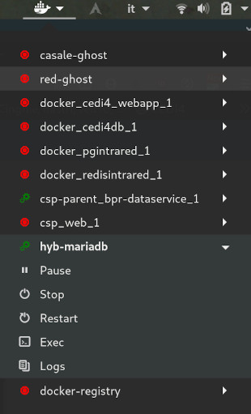

# Gnome shell extension for Docker

## Motivation

During a school project, I had to manage a lot of docker containers. Always going into a terminal to run `docker run xxx` was not really productive, so I decided to develop this extension.

## Usage

When installing this extension, you will be able to manage your docker containers.

The following actions are available :

- Start
- Pause
- Stop
- Remove

## Screenshot

## Installation

You can install this extension by following this [link](https://extensions.gnome.org/extension/1065/docker-status/).

## Contribution

Please feel free to contribute by sending pull requests or raising issues.

## License

Licensed under the GNU General Public License Version 2. See COPYING for details.

## Authors

- gpouilloux (Guillaume Pouilloux)
