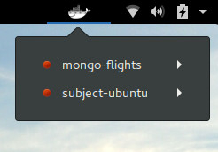

# Gnome Shell extension for Docker

## Usage

When installing this extension, you will be able to control your docker containers.

The following actions are available :

- Start
- Stop
- Pause
- Restart
- Exec
- Logs

## Screenshot

## Installation

You can install this extension by following this [link](https://extensions.gnome.org/extension/2224/easy-docker-containers/).

## Authors

- kiuma (Andrea Chiumenti)

## Credits

- [gpouilloux \(Guillaume Pouilloux\)](https://github.com/gpouilloux/gnome-shell-extension-docker)
